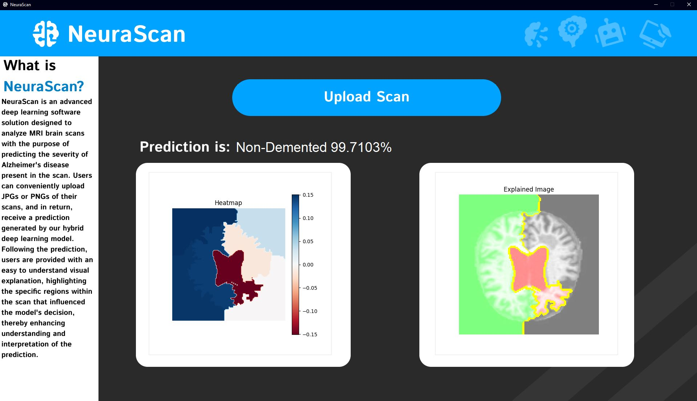

# NeuraScan
https://github.com/willSherry/NeuraScan

### NeuraScan utilizes a hybrid deep learning model designed to analyse MRI brain scans of patients potentially afflicted by dementia. By accepting uploaded JPGs and PNGs of MRI scans, NeuraScan provides users with predictions of the severity of dementia located in the scan, accompanied by detailed visual explanations to give insight to the underlying predictive mechanisms from the model using LIME.

## How to install:
1.  To get NeuraScan set up and working, the first thing you will need to do is make sure you have 
    Python 3.11 installed on your computer. You can get it from the link below:
    ### https://www.python.org/downloads/release/python-3117/
2.  Next, download the project and open it in an IDE and run this command in the terminal:
          
        pip install -r requirements.txt
    
This will install every package required to run NeuraScan.  

3.  Run NeuraScan.py

## _Alternatively_
1.  After installing Python, open command prompt and change directory to the project directory.
2.  Enter the command :
    
        pip install -r requirements.txt
3.  Then enter the command:
        
        python NeuraScan.py

### These are both the ways you can get NeuraScan up and running on your PC.

# Technologies
* matplotlib
* numpy
* future
* pillow
* keras
* opencv-python
* tensorflow
* tqdm
* lime
* scikit-image